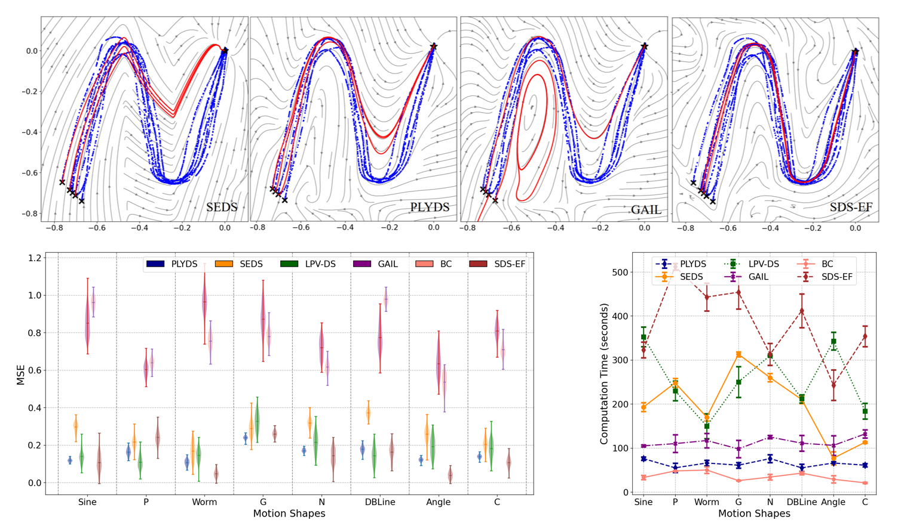

 

### Design overview

Our method (PLYDS) benefits from trainable polynomial for both the planning policy and the safety certificate, providing adaptable complexity for different expert demonstrations.

### Summary of results
PLYDS is shown to improve over some baselines despite the simple formulation and computation efficiency for 2-dimensional motion planning problems.

