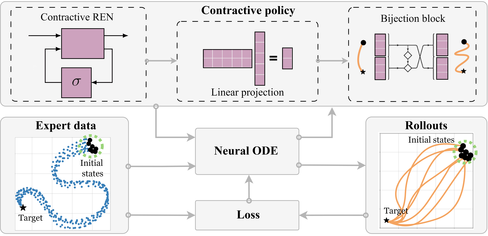

 

### Design overview
The contraction property enables efficient out-of-sample recovery, especially in the face of perturbations. By utilizing contractive policies, we extend beyond the typical convergence guarantees of stable dynamical systems, offering certificates on the transient behavior of induced trajectories in addition to global convergence guarantees. We achieve notable improvements in out-of-sample recovery for various robots in navigation and manipulation tasks.

There are three main steps in learning contractive policies with SCDS:

 - Initial conditions are passed to the differentiable Neural ODE solver to generate state trajectories.

 - A tailor-made loss penalizes the discrepancy of the generate and expert trajectories, and updates the policy parameters.

 - Within the contractive policy, the REN module ensures contraction, the linear transformation adjusts the dimension of the latent space, and the bijection block boosts the policy's expressive power while preserving contraction properties.

### Summary of results
After training on expert demonstrations, the policy can be deployed with a low-level controller. The contractivity and, in turn, global stability of the policy facilitates reliable execution and out-of-sample recovery.

Theoretically, our method can be deployed for planning in various robotics systems and scenarios. We explore such use case for manipulation and navigation on Franka Panda and Clearpath Jackal robots, respectively.

