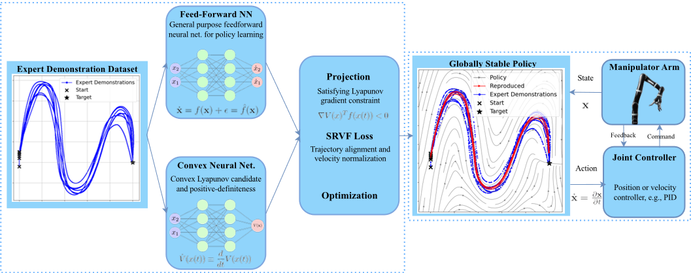
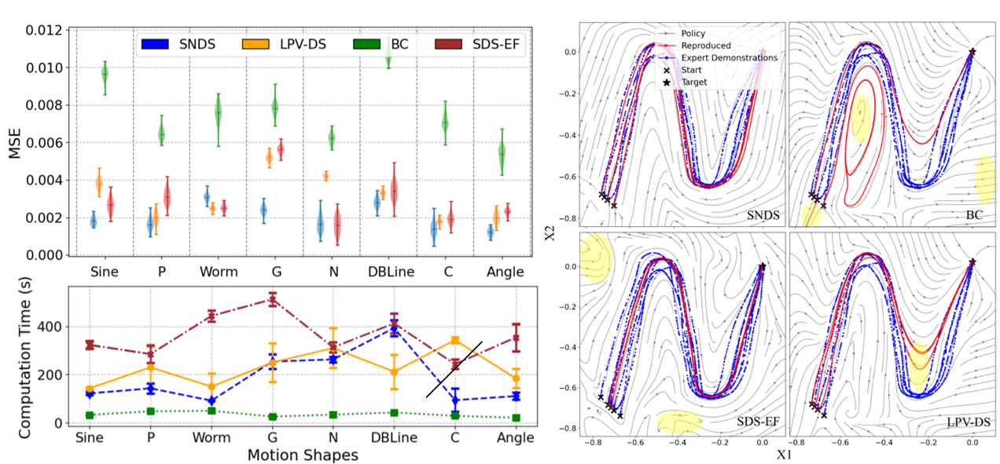

 

### Design overview

Our approach uses a neural policy architecture based on the Lyapunov theorem to provide formal stability guarantees, using projection at each step, and a cost function tailored to yield reliable policy rollouts by adding both a state and action term in the overall loss function.

### Summary of results
Through extensive simulations and real-world tests on a manipulator arm, we demonstrated that SNDS addresses instability, accuracy, and computational challenges better than previous imitation learning methods, making it a promising solution for stable policy learning in complex scenarios.

